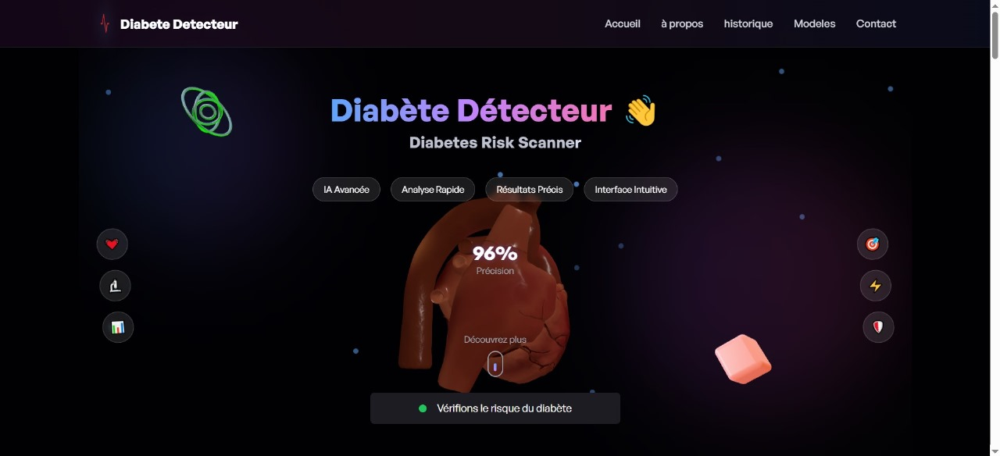
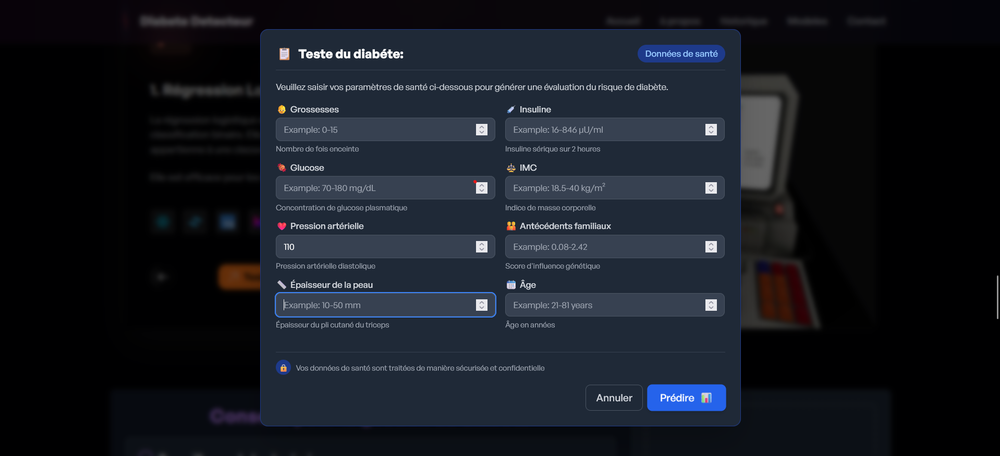
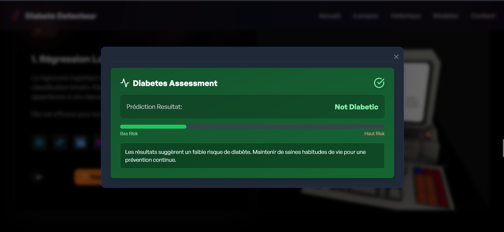

# 🩺 Diabetes Prediction App

  

An intelligent web application that predicts the likelihood of diabetes using **11 Machine Learning algorithms** and an **Artificial Neural Network (ANN)**. This project combines data science and modern web technologies to deliver a fast and interactive user experience.

## 🚀 Features

- Predicts diabetes cases based on health-related input parameters.
- Integrated 11 ML models (e.g., Logistic Regression, SVM, Decision Tree, Random Forest, etc.).
- Deep Learning with an Artificial Neural Network (ANN).
- Dynamic, user-friendly web interface.
- Interactive transitions and animations using Framer Motion.

## 🧠 Machine Learning & Deep Learning

We implemented and compared the performance of the following models:

1. Logistic Regression
2. Support Vector Machine (SVM)
3. Decision Tree
4. Random Forest
5. K-Nearest Neighbors (KNN)
6. Naive Bayes
7. Gradient Boosting
8. XGBoost
9. LightGBM
10. AdaBoost
11. Bagging
12. Artificial Neural Network (ANN)
📊 Models were evaluated using **Accuracy, Precision, Recall, and F1-Score**.

### 📝 Pop up 

### 📊 Prediction Result

## 🛠️ Tech Stack

### 💻 Frontend
- [React.js](https://reactjs.org/)
- [Tailwind CSS](https://tailwindcss.com/)
- HTML, CSS, JavaScript
- [Framer Motion](https://www.framer.com/motion/) – for animations
- 
### 🧪 Backend
- [Flask](https://flask.palletsprojects.com/) – Python micro-framework for API and model handling
- [Joblib](https://joblib.readthedocs.io/) – to load trained models
